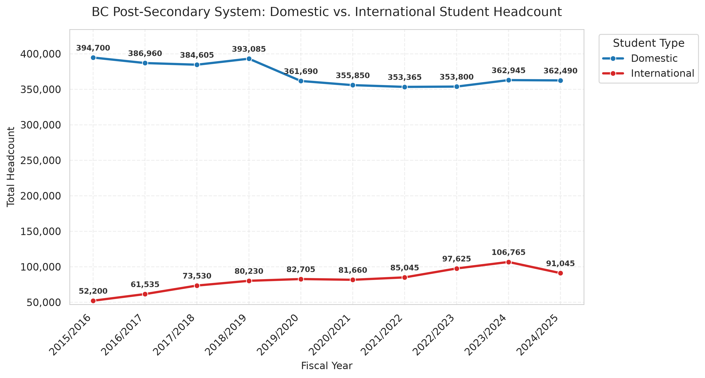
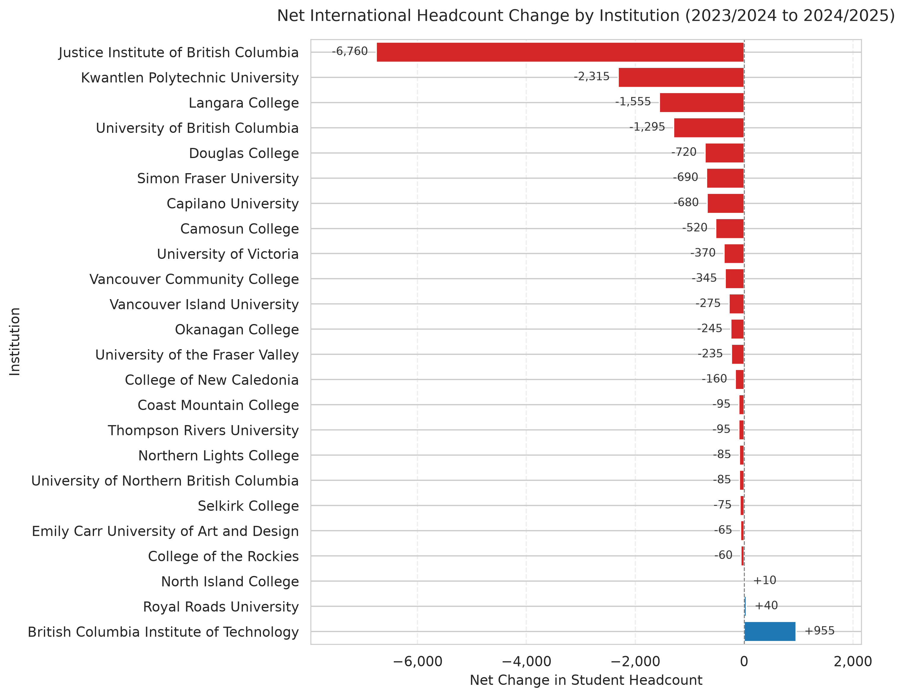
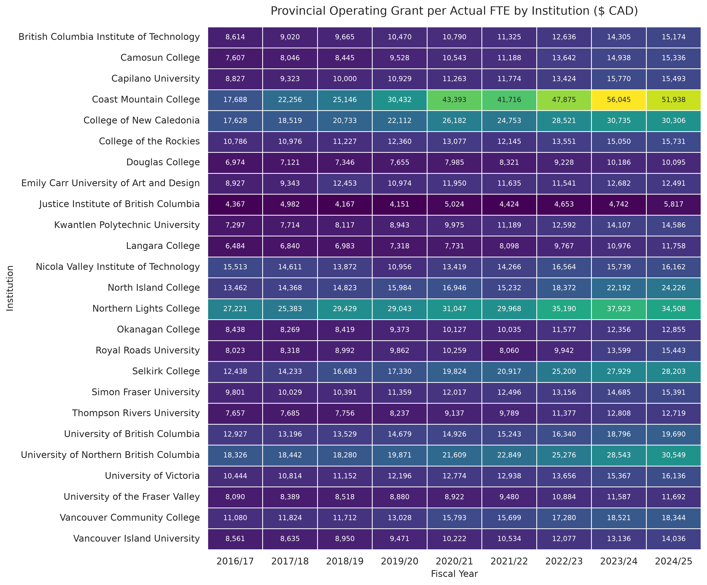
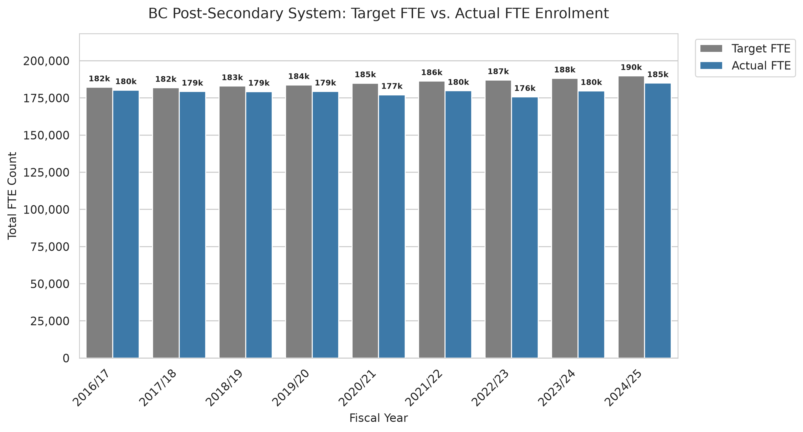

# BC Post-Secondary Enrollment & Funding Trends

An end-to-end SQL and Python analytics project evaluating international and domestic enrollment patterns, system-wide headcount stability, target-vs-actual capacity, and provincial operating grant distribution across B.C. public post-secondary institutions.

---

## Problem Statement

Public post-secondary institutions in British Columbia have experienced significant demographic shifts and policy adjustments over the past decade. Understanding how international student enrollment has evolved relative to domestic enrollment—and how provincial operating grants per Full-Time Equivalent (FTE) are distributed across regional colleges, institutes, and research universities—is critical for institutional resource allocation and policy analysis.

This project addresses four core analytical questions:
1. **Enrollment Composition**: How has the proportion of international versus domestic student headcount shifted across public institutions over time?
2. **System Stability & Contraction**: Which institutions experienced the steepest shifts and net reductions during recent international enrollment contractions?
3. **Funding Parity**: How do provincial operating grants per actual FTE vary across institutional designations and geographic regions?
4. **Capacity Utilization**: How closely do actual FTE enrolments track provincial target FTE allocations across the system?

---

## Data Sources & Licensing

This project utilizes open datasets provided by the Government of British Columbia under the **Open Government Licence — British Columbia**:

* **Full-Time Equivalent (FTE) Enrolments**: [FTE Enrolments at B.C. Public Post-Secondary Institutions](https://catalogue.data.gov.bc.ca/dataset/full-time-equivalent-enrolments-at-b-c-public-post-secondary-institutions)
* **FTE Targets**: [Full-Time Equivalent Enrolment Targets](https://catalogue.data.gov.bc.ca/dataset/full-time-equivalent-enrolment-targets-at-public-post-secondary-institutions)
* **Operating Grants**: [Operating Grants at B.C. Public Post-Secondary Institutions](https://open.canada.ca/data/en/dataset/6358b21a-ce9f-4b73-a4d0-7e30f7885959)
* **Domestic and International Student Headcount**: [Headcount by Economic Development Region and Institution](https://open.canada.ca/data/en/dataset/ace77db4-1f4f-4db1-91bf-9cf8475d9dfc)

> **Data Baseline & Scope Notice**
> * **Baseline Date**: All source datasets reflect official public records retrieved and verified as available on **September 9, 2026**.
> * **Institutional Scope**: Covers all **21 public post-secondary institutions** in British Columbia (private career colleges and non-funded entities excluded).
> * **Local Setup**: Raw CSV source files (`data/raw/`) and the local SQLite database (`data/processed/enrollment.db`) are excluded via `.gitignore`. Download the datasets above to initialize locally.

---

## Project Structure

1-bc-postsecondary-enrollment-trends/  
├── data/  
│   ├── processed/                      # Cleaned datasets, enrollment.db, and exported PNG figures  
│   └── raw/                            # Source CSV downloads from B.C. Open Data  
├── notebooks/  
│   ├── 01_data_inspection.ipynb        # Initial exploratory analysis and data profile inspection  
│   └── 05_python_analysis_viz.ipynb    # Visualizations and database query integration  
├── scripts/  
│   ├── 02_data_cleaning.py             # Data transformation, standardization, and tidying  
│   ├── 03_db_migration.py              # SQLite schema build and data loading  
│   └── generate_institution_mapping.py # Cross-dataset institution name mapping generator  
├── sql/  
│   └── 04_analytical_queries.sql       # Analytical SQL queries (CTEs, Window Functions)  
├── .gitignore                          # Excludes raw data, SQLite DBs, and virtual environments  
├── LICENSE                             # MIT License  
├── README.md                           # Project documentation  
├── notes.md                            # Data inspection and mapping development notes  
└── requirements.txt                    # Pinned project dependencies  

---

## Key SQL Techniques Demonstrated

* **Window Functions & Lag Analysis**: Evaluated Year-over-Year (YoY) percentage changes in international headcount using `LAG() OVER (PARTITION BY ... ORDER BY ...)`.
* **Rolling Aggregations**: Calculated a system-wide 3-year rolling average FTE using `AVG(...) OVER (ORDER BY fiscal_year ROWS BETWEEN 2 PRECEDING AND CURRENT ROW)`.
* **Multi-Fact CTE Joins**: Integrated independent headcount, FTE, and grant fact tables using Common Table Expressions (CTEs) to derive metrics such as `Operating Grant per Actual FTE`.
* **Division Safeguards**: Employed `NULLIF()` logic to prevent zero-division errors during automated ratio computation.

---

## Key Findings

### 1. Macro Enrollment Trends: Post-2023 International Contraction
System-wide domestic headcount experienced a gradual decline from ~394,700 (2015/16) before stabilizing around ~362,500 (2024/25). Conversely, international student headcount doubled from 52,200 to a peak of 106,765 in 2023/24, followed by an immediate sharp contraction to 91,045 in 2024/25 (-14.7% YoY system-wide).

### 2. Institutional Volatility: Concentrated Headcount Reductions
The recent contraction in international student enrollment was highly concentrated across specific teaching universities and regional colleges. Between 2023/24 and 2024/25, the Justice Institute of British Columbia (-6,760), Kwantlen Polytechnic University (-2,315), Langara College (-1,555), and UBC (-1,295) experienced the largest net headcount drops. Conversely, BCIT maintained positive net growth (+955).

### 3. Funding Parity: Provincial Grant Allocation per Actual FTE
Provincial operating grant funding per actual FTE varies substantially across institutional designations. Northern and specialized institutions—such as Coast Mountain College ($51,938/FTE in 2024/25), Northern Lights College ($34,508/FTE), and UNBC ($30,549/FTE)—receive significantly higher operating grant allocations per FTE compared to high-density metro universities like Kwantlen ($14,586/FTE) or Langara ($11,758/FTE), reflecting geographical delivery overheads and facility scale.

### 4. Planned Capacity vs. Delivery: System Target Variance
Across all reported fiscal years, B.C. public post-secondary actual FTE enrolments consistently trailed provincial target FTE allocations. In 2024/25, the system delivered 185k actual FTEs against a target allocation of 190k FTEs (~97.3% target attainment).

---

## Limitations

* **Public Sector Scope**: Results apply strictly to B.C. public post-secondary institutions and cannot be generalized to private career colleges or non-funded entities.
* **Data Suppression**: Low-count headcount cells in public datasets are suppressed for privacy compliance, resulting in minor truncation for small specialized student cohorts.

---

## How to Run

### 1. Environment Setup
Clone the repository and set up a virtual environment:

git clone https://github.com/kellycheung5-collab/1-bc-postsecondary-enrollment-trends  
cd 1-bc-postsecondary-enrollment-trends

# Create and activate virtual environment
python -m venv .venv  
source .venv/bin/activate  # On Windows: .venv\Scripts\activate

# Install required packages
pip install -r requirements.txt

### 2. Download Data
1. Download the source CSV datasets from the B.C. Data Catalogue links listed under Data Sources & Licensing.
2. Place the uncompressed CSV files into the data/raw/ folder in your project root directory.

### 3. Build Database & Run Pipeline
Execute the data processing and database setup scripts sequentially from the project root:

# 1. Generate institution mapping file
python scripts/generate_institution_mapping.py

# 2. Clean raw CSVs and export processed data
python scripts/02_data_cleaning.py

# 3. Create SQLite schema and migrate processed data into enrollment.db
python scripts/03_db_migration.py

### 4. Run Analysis & Visualizations
Launch Jupyter Notebook to execute the visualization and query pipeline:

jupyter notebook notebooks/05_python_analysis_viz.ipynb

---

## License

Distributed under the **MIT License**. See `LICENSE` for details. Data utilized under the **Open Government Licence — British Columbia**.